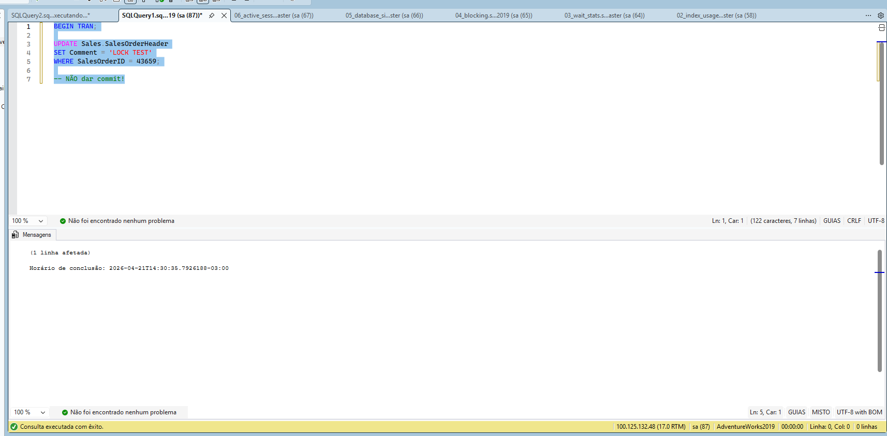
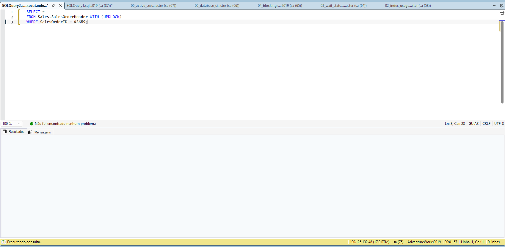
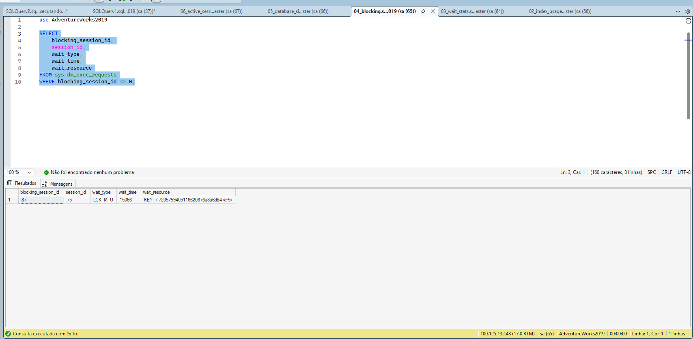
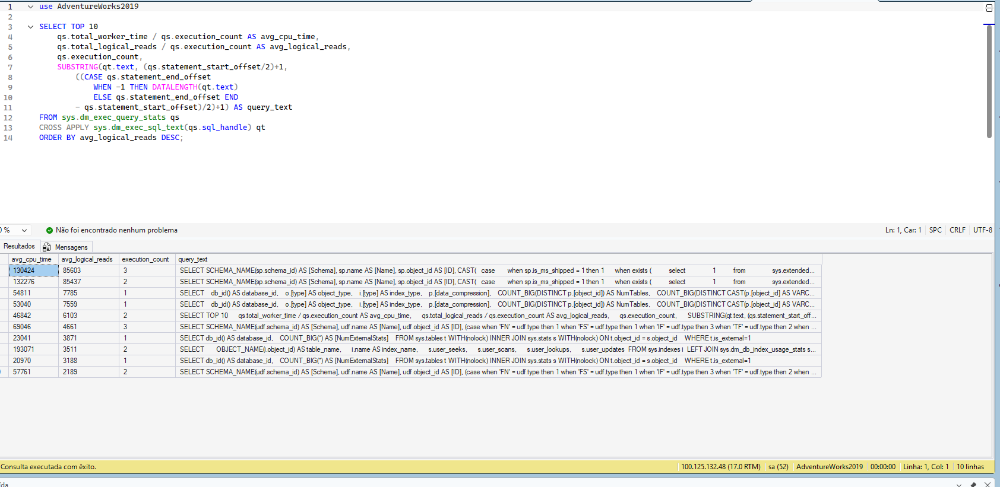
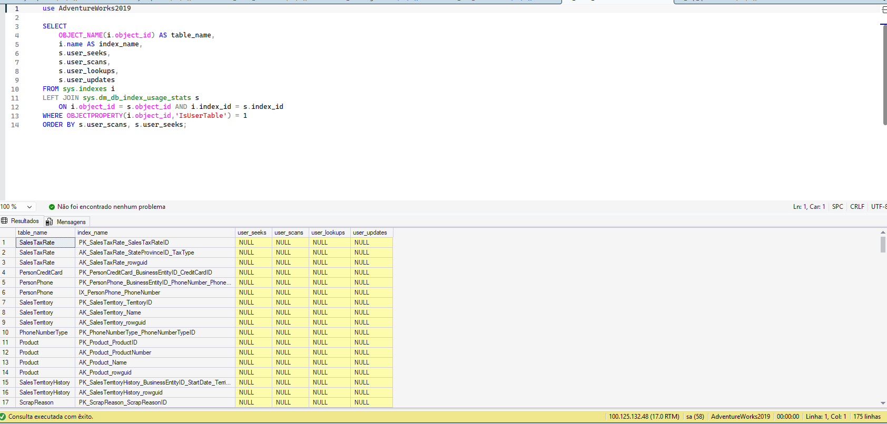
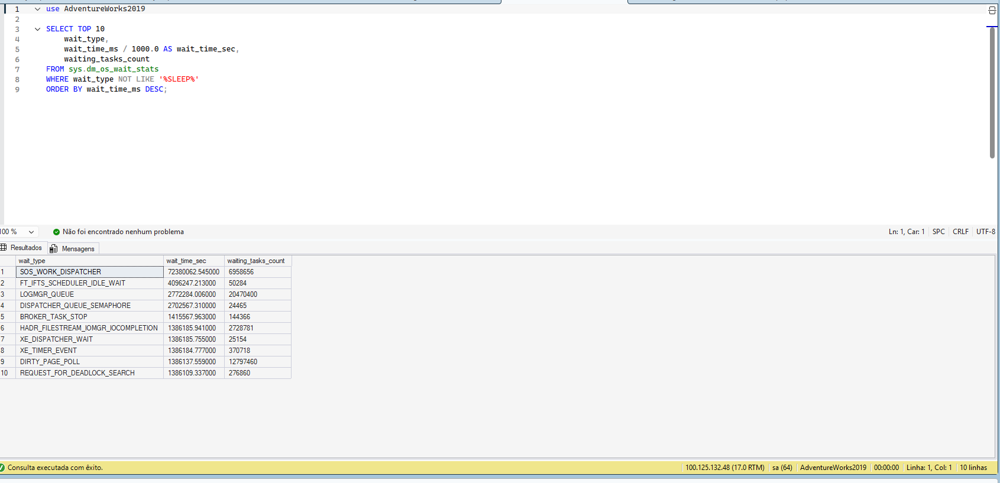
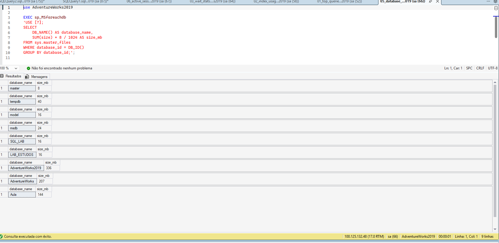
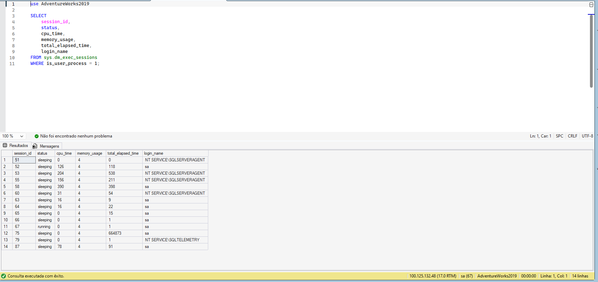

SQL Server monitoring project: blocking simulation, DMVs analysis, wait stats, index usage and active sessions. Foco em diagnóstico e troubleshooting de performance.

# 🧠 SQL Server Monitoring & Diagnostics

Projeto focado em monitoramento e diagnóstico de performance no SQL Server utilizando DMVs.

---

# 🇧🇷 Versão em Português

## 📌 Objetivo

Demonstrar técnicas de monitoramento, identificação de gargalos e troubleshooting no SQL Server.

---

## 📂 Estrutura

scripts/
├── 01_top_queries.sql
├── 02_index_usage.sql
├── 03_wait_stats.sql
├── 04_blocking.sql
├── 05_database_size.sql
└── 06_active_sessions.sql

---

# 🧪 Simulação de Blocking (Destaque)

## 🟥 Sessão 1 — Transação aberta

---

## 🟨 Sessão 2 — Gerando bloqueio

---

## 🟢 Sessão bloqueada detectada

---

## ⚠️ Análise

* Transação aberta mantém lock ativo
* Outra sessão tenta acessar o mesmo recurso
* O SQL Server gera bloqueio
* DMV sys.dm_exec_requests identifica o problema

---

# 📊 Monitoramento Geral

## 🥇 Queries mais pesadas

📌 Identifica queries com maior consumo de CPU e IO

---

## 🥈 Índices pouco utilizados

📌 Identifica índices com baixo uso

---

## 🥉 Gargalos (Wait Stats)

📌 Mostra onde o SQL Server está aguardando recursos

---

## 🧪 Tamanho dos bancos

📌 Planejamento de capacidade

---

## ⚡ Sessões ativas

📌 Monitoramento em tempo real

---

## 🧠 Aprendizados

* Uso de DMVs para monitoramento
* Identificação de gargalos
* Diagnóstico de blocking
* Análise de sessões e queries

---

# 🇺🇸 English Version

## 📌 Objective

This project demonstrates SQL Server monitoring and diagnostics using DMVs.

---

# 🧪 Blocking Simulation

## 🟥 Session 1 — Open transaction

---

## 🟨 Session 2 — Blocking scenario

---

## 🟢 Block detected

---

# 📊 Monitoring

## 🥇 Top Queries

---

## 🥈 Index Usage

---

## 🥉 Wait Stats

---

## 🧪 Database Size

---

## ⚡ Active Sessions

---

## 🧠 Key Learnings

* Monitoring SQL Server with DMVs
* Identifying bottlenecks
* Detecting blocking
* Real-time diagnostics
